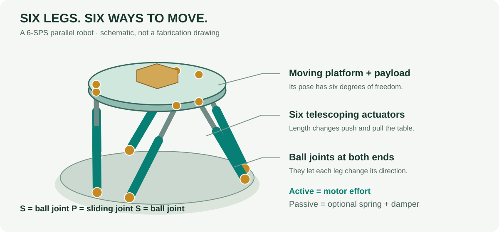
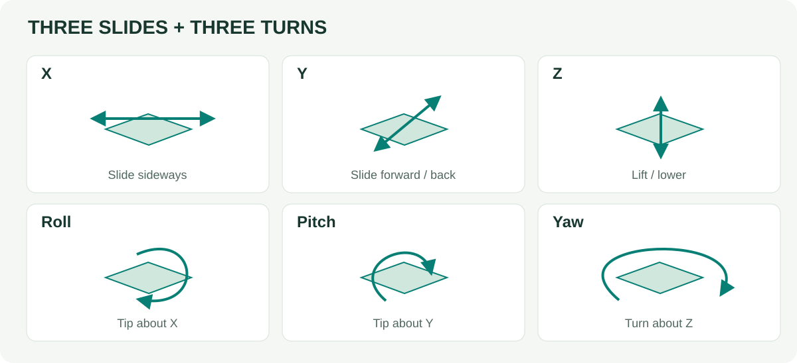
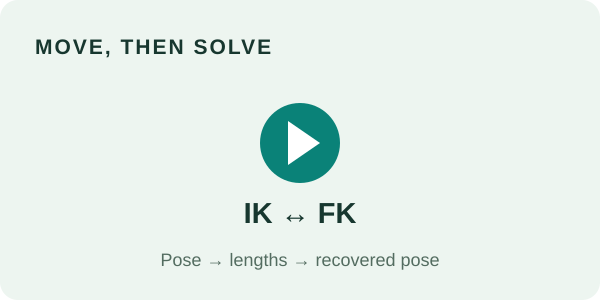
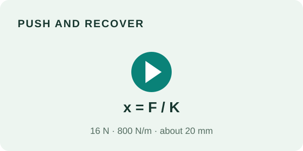
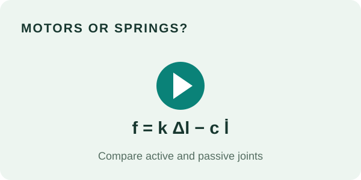
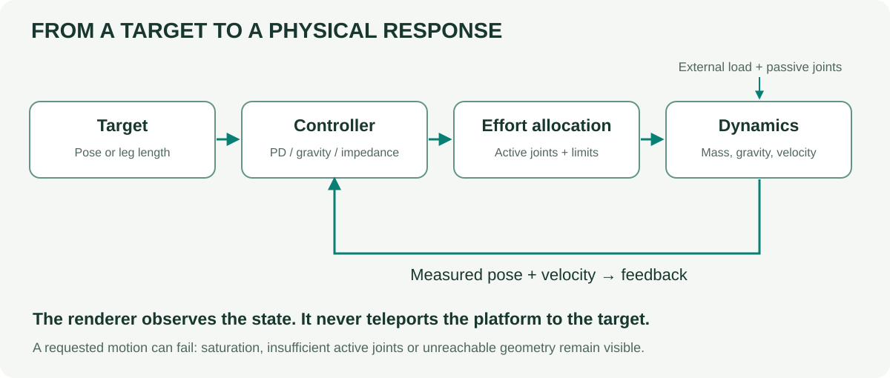
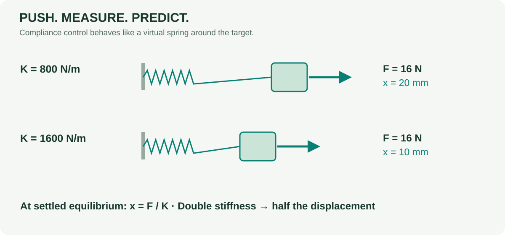

<div align="center">

# Stewart Platform Lab

**Six legs. Real forces. One place to explore robotics.**

A browser-based 3D physics playground: move a platform, push it, change its joints, then follow the equations into the code.

[**Open the simulator →**](https://tinmanlab.github.io/stewart_platform/) &nbsp; · &nbsp; [**Start learning**](docs/START_HERE.md) &nbsp; · &nbsp; [**Watch the demos**](docs/GALLERY.md)

[](https://tinmanlab.github.io/stewart_platform/)

No account. No runtime dependencies. No physical hardware connection.

</div>

## Try it in three minutes

Open the lab. Press **Reset**. Change **Z** from **550 to 575 mm**. Now set **Roll** to **4°**. Which legs became longer?

The outline is the **target**. The solid table is the **actual result of physics**. Motors apply forces; the renderer never teleports the platform to the target. Drag to orbit, scroll to zoom, and press **Space** to pause. **Quick start** explains the controls.

The English simulator can also run offline: `python build.py`, then open `site/index.html`. The full learning website is built separately. A frozen [Korean original](archive/ko/README.md) is preserved, not overwritten.

## Pick your starting point

| Start here | Question to investigate | Next stop |
|---|---|---|
| **Explore · elementary** | Can you make the table nod? Predict which legs move. | [First three minutes](docs/START_HERE.md) |
| **Measure · middle / high school** | Does twice the stiffness mean half the movement? | [Force and displacement](docs/EXPERIMENTS.md) |
| **Model · undergraduate** | How do six lengths become a pose, a Jacobian and motor forces? | [Equations](docs/THEORY.md) |
| **Investigate · graduate** | What do the dynamics, allocation residuals and tests actually establish? | [Code map](docs/CODE_MAP.md) · [Evidence](docs/VALIDATION.md) |



Age labels are invitations, not prerequisites. Start wherever the pictures make sense and go deeper when you are curious.

## Three short demonstrations

<table>
<tr><td width="33%"><a href="https://tinmanlab.github.io/stewart_platform/learn/GALLERY.html"></a><br><b>1 · Move, then solve</b><br>Use IK controls, copy lengths and solve FK.<br><a href="https://tinmanlab.github.io/stewart_platform/?demo=ik">Try the experiment →</a></td><td width="33%"><a href="https://tinmanlab.github.io/stewart_platform/learn/GALLERY.html"></a><br><b>2 · Push and recover</b><br>Feel a virtual spring with compliance control.<br><a href="https://tinmanlab.github.io/stewart_platform/?demo=compliance">Try the experiment →</a></td><td width="33%"><a href="https://tinmanlab.github.io/stewart_platform/learn/GALLERY.html"></a><br><b>3 · Motors or springs?</b><br>Compare gravity compensation and passive joints.<br><a href="https://tinmanlab.github.io/stewart_platform/?demo=passive">Try the experiment →</a></td></tr>
</table>

[Video gallery and transcripts](docs/GALLERY.md) · [Four repeatable experiments](docs/EXPERIMENTS.md)

Clips use actual browser controls and the fixed-step physics solver. Playback is deliberately slowed for teaching; it is **not a real-time performance measurement**. Videos have text captions, controls and written alternatives. They are generated for the website, rather than stored as large binaries in Git history.

## What is inside?



**Kinematics:** analytic inverse kinematics, independently solved local forward kinematics, length Jacobian and a scaled conditioning diagnostic.

**Physics and control:** finite-mass 6-SPS rigid-body dynamics; IK/length PD, model-based gravity compensation, task-space spring–damper impedance, manual effort and drives-off modes. Inverse dynamics is an effort diagnostic, not a separate computed-torque controller.

**Joints and experiments:** all **18 joints** independently active/passive; passive stiffness, damping and rest configuration; ideal active spherical-joint torques; actuator effort limits; external forces and impulses; geometry/mass editing; project JSON and telemetry CSV.



**Passive is not locked.** Zero stiffness and damping mean a free passive joint. Turning motors off does not turn gravity or passive springs off. A requested motion may be unreachable or underactuated; residuals and physical errors remain visible.

## Useful model, explicit limits

This is an **educational custom simulator**, not hardware-validated engineering software. Platform motion has six freedoms; the solver also retains six internal leg-spin speeds. The model includes moving-body mass/inertia, gravity and velocity coupling.

It does **not** model self-collision, friction, backlash, flexible links, motor electronics or realistic ball-joint travel. Stops and floor contact use penalties. FK is local, not an enumeration of all assembly modes. Active ball joints are idealized three-axis torque sources. A successful geometry check is not a manufacturability or safety certificate.

[Model and assumptions](docs/THEORY.md) · [Tests and claim boundaries](docs/VALIDATION.md) · [Original papers and books](docs/REFERENCES.md)

## Run, inspect or contribute

```sh
# Standalone app: Python standard library only.
python build.py
# Open site/index.html in a browser.

# Full educational website and development checks:
python -m pip install -r requirements-dev.txt
python -m playwright install chromium
node tests/core.test.cjs
node tests/endurance.test.cjs
python tests/english.test.py
python tests/browser_smoke.py
python tools/record_demos.py       # requires FFmpeg; creates three clips
python build.py --site
python tests/site.test.py
python -m http.server 8000 --directory site
```

Visit `http://localhost:8000` for the complete local website. Tested development baseline: Node 22 and Python 3.13. The application itself is self-contained JavaScript, HTML and CSS. Exported projects open paused on import.

| Location | Owner |
|---|---|
| `src/` | Mechanics, renderer, English UI and small lesson entry points |
| `docs/` | Learning text, equations, references and original SVGs |
| `tests/` | Numerical, browser, localization and site checks |
| `examples/` | Reproducible project files and a headless example |
| `archive/ko/` | Byte-preserved Korean v1.0, with checksum |
| `site/` | Generated output; do not hand-edit |

The repository uses pull requests, commit-pinned Actions and a least-privilege test/build/deploy workflow. [Contributing](CONTRIBUTING.md) explains the small review checklist. Repository protection rules are server-side settings, not implied by these files. The maintainer's one-time [Pages setup](docs/PUBLISHING.md) activates the web link; a URL alone is not deployment evidence.

## Credit and reuse

MIT, preserving the repository's existing license. Diagrams are original teaching illustrations; recordings show this app. References include Stewart (1965), Dasgupta & Mruthyunjaya (2000), Merlet (2006), Hogan (1985), and Lynch & Park (2017). See [references and attribution](docs/REFERENCES.md) for exact bibliographic records and what each source supports. Use [CITATION.cff](CITATION.cff) to cite the software; it has no assigned DOI.
